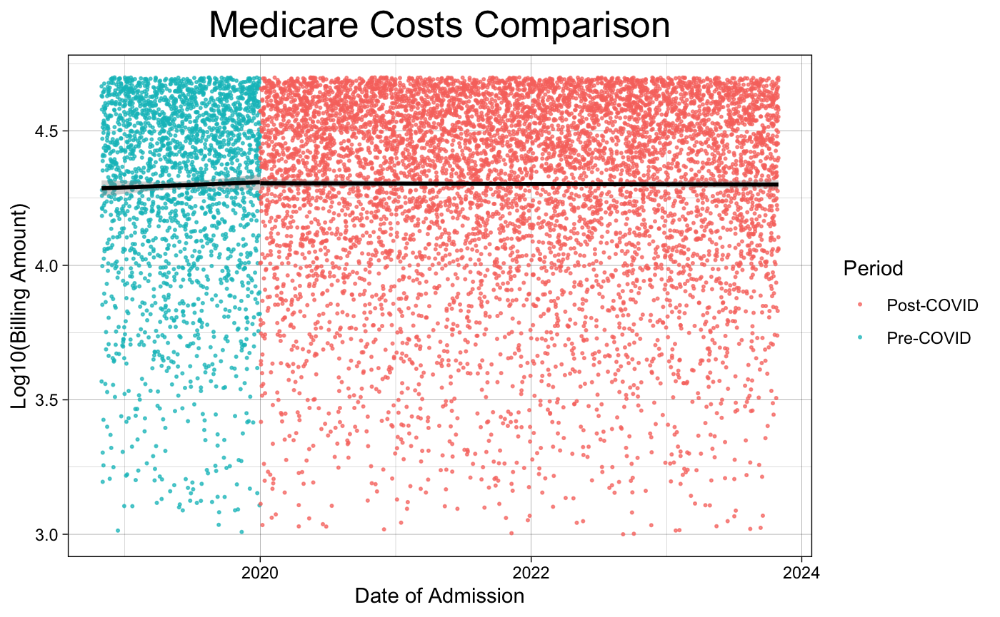
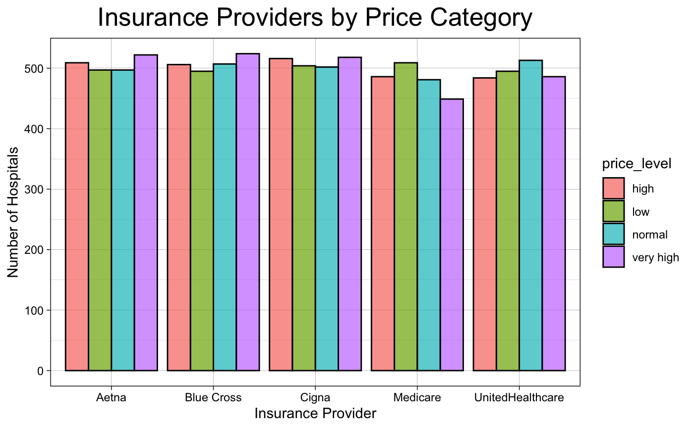
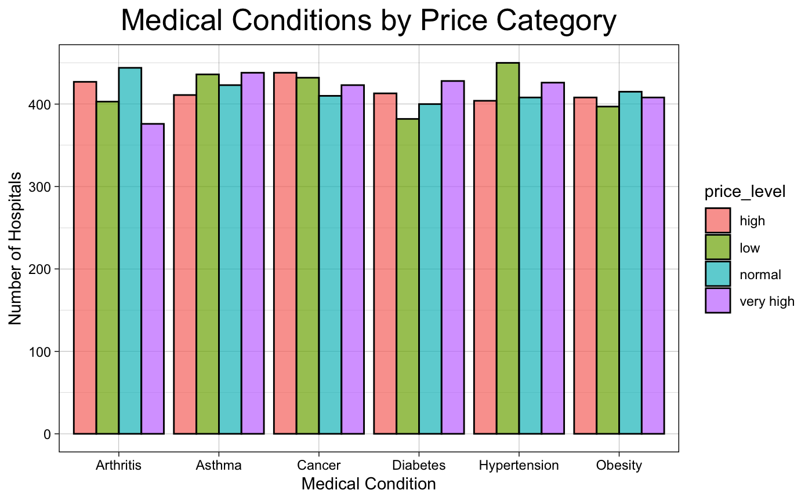

```{r setup, include=FALSE}
knitr::opts_chunk$set(echo = FALSE)
library("jpeg")
```

## About the project creators  
Clive Smith is a second year Biological Sciences major.

Iliya Voytsyshyn is a second year Genetics major.


## A bit about the data...
The main dataset that we used for this project is a list of hospitals across the US with information such as medical conditions, insurance providers, billing amounts, and more. 

The other data set that we used is a list of hospitals with their locations listed. The main purpose of this data set was to get the latitudes and longitudes of hospitals in the US.

These two data sets are from a website called Kaggle, which has a large offering of data sets to choose from.  

## Project Overview  
Our main goal for this project was to create an app that could give you the locations of the best hospitals across the US based on your medical condition and insurance provider. We also performed some other analysis of the data separate from the app.  


## An important note

The way that we measured the quality of hospitals was by multiplying the billing amount for each patient by how long each patient was in the hospital. The lower the average value, the better the hospital. 

This method isn't perfect, but given the data we had, we felt that this was the best way to measure quality.  

## Part 0: Cleaning the data

For the main hospitals data set, we removed two variables, blood type and hospital room number. We also removed the names of the doctors, and changed the names of the patients into numerical IDs.

For the locations data set, we kept the most important information regarding the locations of each hospital We also replaced some information listed as "NOT AVAILABLE" with NAs.  

## Part 1: Some basic analysis  


## Slide 1

```{r}

```
  

## Slide 2
```{r echo=FALSE, fig.align="center", out.width="50%"}

```

```{r echo=FALSE, fig.align="center", out.width="50%"}

```


